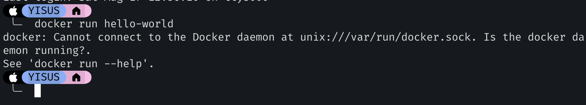

# Instalar Docker en MacOs

Si usas un pc Mac tal vez te hayas encontrado con problemas al ejecutar docker



Para usar docker en MacOs es necesario hacerlo a través de [Colima](https://github.com/abiosoft/colima). 

[Por qué colima?](https://www.youtube.com/watch?v=7zgNe1CRJl0)

### Entonces cómo ejecutamos comandos de docker?
1. Usamos `brew` para instalar docker y luego colima
    ```
    brew install docker
    brew install docker-compose
    brew install colima
    ```

2. Iniciamos colima [opcionalmente podemos usar las flags correspondiente para especificar las configuraciones de la vm que creará]
    ```
    colima start
    ```

3. Ejecutamos docker con normalidad
    ```
    docker run hello-world
    ```
    
4. Detenemos nuestras vm de colima si ya no queremos tenerlas en ejecución
    ```
    colima stop
    ```
